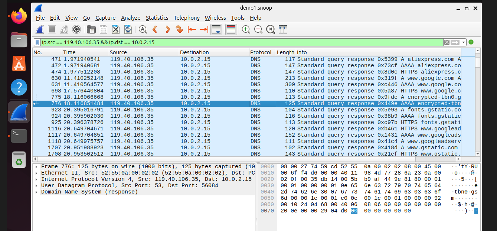
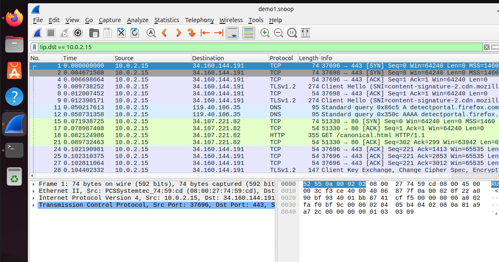
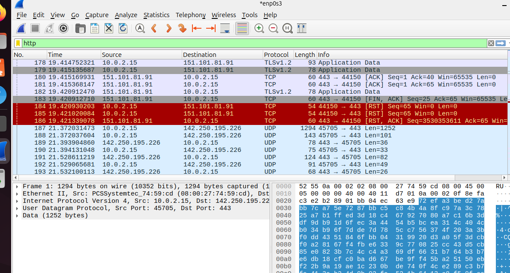
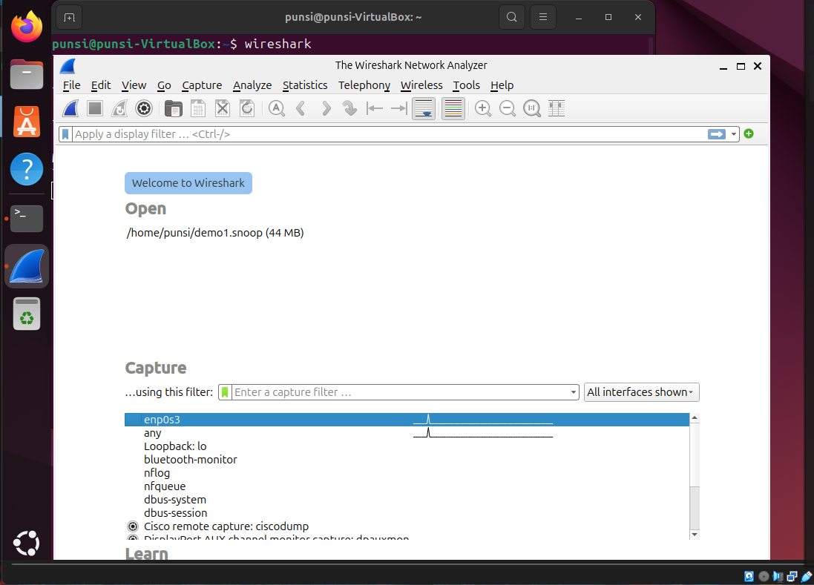
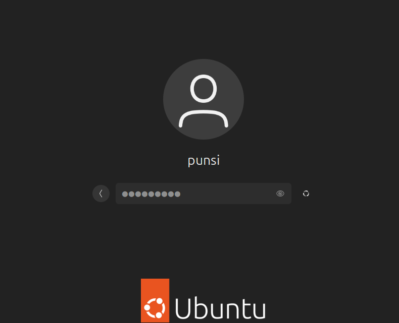

# Network Traffic Analysis Using Wireshark (Ubuntu Lab)

# Overview
This project demonstrates a hands-on network traffic analysis lab conducted using Wireshark in an Ubuntu virtual machine environment.
The goal of this lab was to capture real network traffic and understand how common network protocols operate in real-world communication. Instead of relying only on theory, I generated live traffic using tools such as web browsing, ping, and curl, and then analyzed the packet-level behavior.
During this process, I explored how DNS resolves domain names, how TCP establishes reliable connections using the 3-way handshake, and how HTTP and HTTPS traffic differ in terms of visibility and security.
This project also involved troubleshooting virtual machine networking issues, which helped strengthen my understanding of network configuration and connectivity in a lab environment.
---

## Lab Environment
- VirtualBox
- Ubuntu VM
- NAT Network
- Wireshark
- curl

---

## Traffic Generation
- Browsing websites
- `ping google.com`
- `curl http://example.com`

---

## Analysis

### DNS Analysis
In this section, I analyzed DNS (Domain Name System) traffic to understand how domain names are translated into IP addresses before communication begins.
When accessing a website such as google.com, the system first sends a DNS query to a DNS server to resolve the domain name into its corresponding IP address. Wireshark captures both the DNS request and the response from the server.
From the captured traffic, I was able to observe:
- DNS query packets sent from the client
- DNS response packets containing the resolved IP address
- The relationship between domain names and their IP mappings

This process is critical because all network communication relies on IP addresses, and DNS acts as the bridge between human-readable domain names and machine-level addressing.

---

### TCP Analysis
I captured and analyzed TCP packets in Wireshark and observed the 3-way handshake process used to establish a connection.
The handshake consists of:
- SYN (client initiates connection)
- SYN-ACK (server acknowledges)
- ACK (client confirms)

---

### HTTP Analysis
Using curl, I captured HTTP traffic and observed readable request/response data.

---

### Wireshark Capture Overview
General traffic capture showing multiple protocols.

---

### Ubuntu Lab Environment
Ubuntu virtual machine used for analysis.

---

## Key Learnings
- DNS resolution process
- TCP 3-way handshake
- HTTP vs HTTPS difference
- Packet filtering in Wireshark
- Basic network troubleshooting

---

## Conclusion
This project provided practical experience in capturing and analyzing real network traffic using Wireshark in a controlled lab environment.
Through this lab, I developed a clearer understanding of how key network protocols operate, including DNS for name resolution, TCP for reliable communication, and HTTP/HTTPS for web traffic. Observing these protocols at the packet level helped bridge the gap between theoretical knowledge and real-world implementation.
Additionally, troubleshooting virtual machine networking issues strengthened my problem-solving skills and improved my understanding of network configurations.
Overall, this project enhanced my foundational knowledge in networking and provided hands-on experience relevant to cybersecurity and SOC analyst roles.
